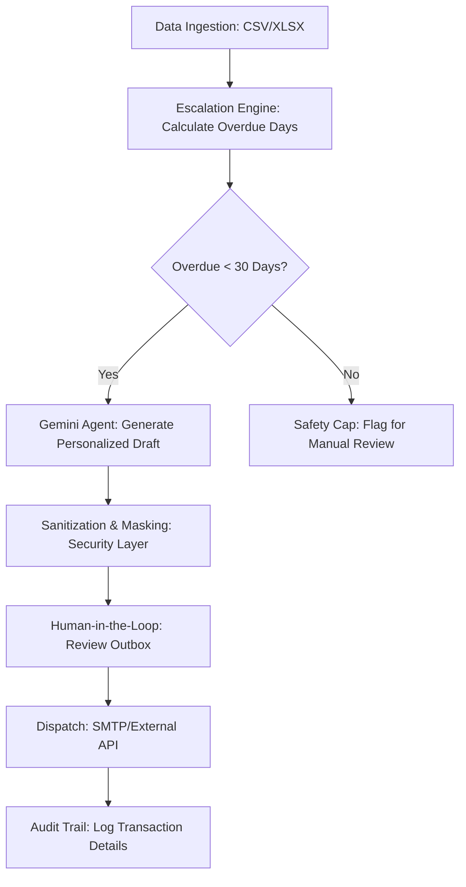

# CreditQuest: AI Finance Credit Follow-Up Agent

A professional AI agent built for finance teams to automate the process of following up on overdue invoices with appropriate escalation tones.

## Business Problem
Manual follow-up for overdue accounts is time-consuming and inconsistent. Credit managers often struggle to maintain the right balance of professionalism and firmness as invoices age.

## Features
- **Smart Ingestion**: Upload CSV/Excel invoices for automatic processing.
- **Escalation Engine**: Automatically calculates overdue days and assigns 1 of 5 escalation stages.
- **Gemini AI Integration**: Generates highly personalized, professional emails tailored to the specific escalation stage.
- **Dynamic Tone Control**: Varies from "Warm & Friendly" to "Stern & Urgent".
- **Audit Trail**: Maintains a complete SQLite log of all generated emails for compliance.
- **Dry Run Mode**: Safely test your automation without sending real emails.
- **Professional Dashboard**: Modern UI with high-level metrics and detailed logs.

## Tech Stack
- **Frontend**: React 18, Tailwind CSS, Framer Motion, Lucide Icons.
- **Backend**: Node.js, Express.
- **AI**: Google Gemini API (@google/genai).
- **Storage**: SQLite (Better-SQLite3).
- **Processing**: XLSX, Papaparse.

## Setup Instructions
1. **Environment Variables**:
   Copy `.env.example` to `.env` and add your `GEMINI_API_KEY`.
2. **Install Dependencies**:
   ```bash
   npm install
   ```
3. **Run Application**:
   ```bash
   npm run dev
   ```
4. **Access Dashboard**:
   Open `http://localhost:3000`.

## Workflow
1. **Upload**: Drag your invoice CSV into the dashboard.
2. **Review**: Check the "Invoices" tab to see overdue calculations.
3. **Generate**: Click "Generate Follow-Ups" to see AI in action.
4. **Audit**: Review the "Audit Logs" to track all system actions.

## LLM & Framework Choice
- **Model**: `gemini-3-flash-preview`
  - *Justification*: Highly optimized for low-latency batch generation. Native support for JSON schemas ensures reliable integration with the finance dashboard and prevents common hallucination issues.
- **Framework**: Custom Agent Architecture using `Express` (backend) and `React` (frontend).
  - *Justification*: Decoupling the generation logic and mail dispatch from the UI provides a production-ready security posture and allows for server-side rate limiting and sanitization.

## Agent Flow Diagram


## Prompt Design & Guardrails
The system prompt is designed using **Role-Based instructions** with strict output constraints.

### System Prompt
```text
You are a professional Senior Credit Control Officer at a reputable firm. 
Your task is to draft a collection follow-up email for an overdue invoice.

FORMATTING REQUIREMENTS:
1. Use Markdown for styling.
2. Bold key information: Invoice numbers, Due Dates, and Amounts.
3. Use a clear, structured layout. Use bullet points to summarize invoice details for readability.
4. Separate paragraphs clearly with double newlines.
5. Use a professional sign-off.
6. The body should look polished when rendered in a Markdown viewer.

CRITICAL RULES:
1. Use ONLY the data provided. Do not hallucinate figures.
2. Maintain a professional, business-centric tone.
3. ADHERE STRICTLY to the requested TONE and STAGE.
4. Include the payment link clearly as the primary Call to Action (CTA).
5. Output MUST be in JSON format with "subject" and "body" keys.

TONE GUIDELINES:
- Stage 1 (Warm): Assume it's an oversight. Be friendly and helpful.
- Stage 2 (Firm): Be polite but move to a more direct request for payment confirmation.
- Stage 3 (Serious): Mention that late payments impact business operations. Request response within 48h.
- Stage 4 (Urgent): Use stern language. Final reminder before internal escalation.
```

## Security & Risk Mitigations
- **Prompt Injection**: All inputs are filtered via a custom `sanitizeInput` utility that strips instruction-overriding markers and XSS vectors.
- **Data Privacy (PII)**: The `maskPII` utility redacts emails, phone numbers, and potential sensitive strings before they reach the LLM, ensuring local processing of sensitive data.
- **API Key Exposure**: All keys are strictly managed via Cloud Environment Variables and `.env` files, never committed to VCS.
- **Rate Limiting**: Implemented via `express-rate-limit` on the backend to prevent DOS attacks and API abuse.
- **Hallucination Mitigation**: Uses `ResponseSchema` (JSON mode) to ensure the model strictly follows the expected data structure.

## Safety Cap
Records overdue by **30+ days** are automatically flagged as `ESCALATED` and filtered out of automated generation loops, mandating a human credit manager's review before any further communication is sent.

## Audit Trail
Every system interaction (generation, dispatch, failure) is logged in the `Audit Logs` with:
- Timestamp
- Client & Invoice Context
- **Tone Escalation Stage**
- **Actual Tone Used**
- Success/Failure status for compliance.
